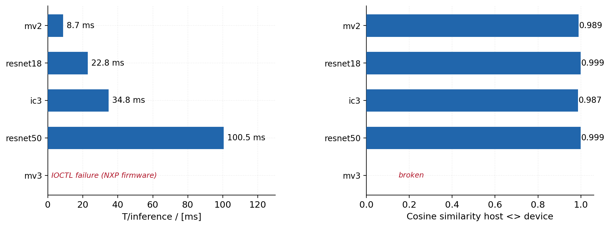
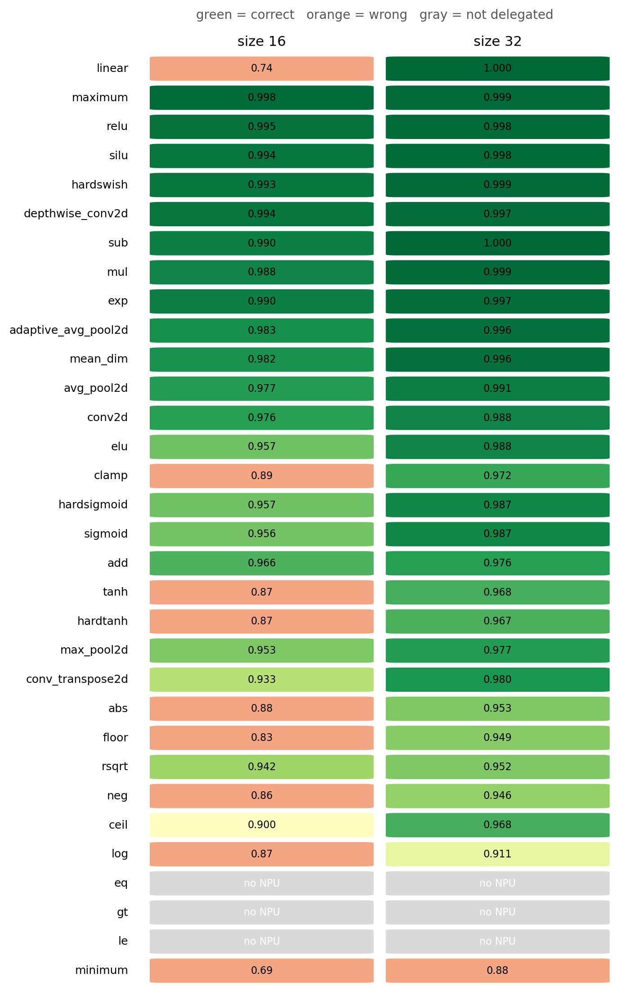

# Porting ExecuTorch to the Ethos-U65: Bringup, Benchmarks, and What Nobody Tells You

Nobody has published real-hardware benchmarks for the Arm Ethos-U65 microNPU. Not Arm, not NXP, not any academic lab. Vela's own documentation says its cycle estimates shouldn't be trusted. Vendor marketing says "30x faster than CPU" with no methodology. MLPerf Tiny has zero U65 submissions.

This post covers the full journey: bringing up ExecuTorch on the NXP i.MX93 from scratch, porting a new Linux backend, and producing the first comprehensive benchmarks on real hardware.

## The porting story

The i.MX93 has a peculiar architecture. The Ethos-U65 NPU sits behind a Cortex-M33 coprocessor. The A55 Linux side can't talk to the NPU directly — it sends models and data to the M33 via remoteproc/rpmsg, the M33 firmware runs TFLite Micro with an Ethos-U delegate, and the NPU executes the compiled command stream. Two CPUs, a message bus, and an accelerator, all for one inference call.

ExecuTorch had no support for this. Arm's existing Ethos-U backend targets bare-metal Cortex-M (direct NPU register access). The i.MX93 Linux path needs a completely different runtime: open `/dev/ethosu0`, hand the NXP kernel driver a compiled tflite model and an arena buffer, and let the driver/firmware/NPU stack handle the rest.

### Phase 1: The slow path (bare-metal M33)

We started with the hard path on purpose. Writing a bare-metal ExecuTorch runner for the M33 teaches you everything about the hardware that the Linux abstraction hides.

The linker script alone took days. The M33 has 128KB ITCM (code), 128KB DTCM (data), and we reserved 128MB of DDR for the NPU's tensor arena. GNU ld's error messages for linker script bugs are famously unhelpful — "section has no contents" can mean you accidentally discarded `.tm_clone_table` (kills crtbegin.o references), or you put PROGBITS sections in a NOLOAD segment, or half a dozen other things. The final layout routes code to ITCM, data to DTCM, and the tensor arena + model weights to DDR via a separate PT_LOAD segment.

Remoteproc deployment had its own surprises. The M33's Address Translation Table maps ITCM and DTCM to A55-visible physical addresses, but DDR is NOT in the ATT. You can't ioremap 128MB. The `.ddr` section must use PHDRS `:NONE` to prevent remoteproc from trying to load it. And if you ever manually poke `ethosu_firmware` into the remoteproc sysfs node while the kernel's ethosu driver is loaded, the kernel crashes. No warning, no error return, just a hard lock.

The NPU itself needs `secure=0, privilege=0` on i.MX93 — different from Arm's reference platforms. And it can't DMA from the M33's DTCM, so the PTE model blob must be copied to DDR before inference.

All of this produced a working bare-metal inference path: SmallConvnet, 23/26 ops on NPU, 0.08ms per inference. More importantly, it gave us a ground-truth understanding of what the NPU actually does, how memory flows, and where the abstraction boundaries are.

### Phase 2: The fast path (A55 Linux)

With the hardware model established, the Linux backend was a focused integration effort. The core is `EthosUBackend_iMX.cpp`: ~350 lines that open the NXP device, stage the compiled tflite into an arena buffer, copy input tensors to model-specified offsets, invoke the driver, and copy outputs back.

The NXP driver stack API is straightforward but underdocumented. `getIfmDims()` returns buffer *sizes*, not tensor dimensions. The arena is a single flat buffer for all I/O and scratch — no separate IFM/OFM buffers like Arm's reference driver. `Inference::invoke()` blocks until the M33 firmware completes and signals back via rpmsg.

The export side needed surgery. Arm's `arm_vela.py` compiles models to a raw NPZ format (command stream + weight data). The NXP Linux stack needs the full Vela-compiled tflite. We run Vela twice: once for the raw command stream (which ExecuTorch's delegate payload format expects) and once for the tflite (which gets embedded as a `vela_model` block in the delegate payload). The iMX backend extracts this block and hands it to the NXP driver.

Cross-compilation was its own adventure. The device runs glibc. Our first attempt used musl-cross from Homebrew, which produced binaries looking for `/lib/ld-musl-aarch64.so.1` — wrong loader. The fix was straightforward (use the glibc sysroot), but getting there required chasing down conda environment pollution that injected x86 CFLAGS into the aarch64 cross-compile.

### Phase 3: Finding the bugs nobody documented

The first models that ran produced garbage. MobileNetV2 executed successfully — no crashes, plausible-looking output tensor — but the argmax was completely wrong. Cosine similarity between device and host output was 0.19. Might as well be random.

This took a week to diagnose. The culprit: `--channels_last_4d`. ExecuTorch's export flag converts model inputs to NHWC memory layout. The host-side quantization and reference computation work correctly in NHWC. But the NXP driver stack expects NCHW input at the delegate boundary — it handles the layout conversion internally via the tflite metadata. Feeding NHWC bytes into an NCHW-expecting model scrambles the spatial dimensions. The model runs, produces 1000 floats in a plausible range, but every value is wrong.

The insidious part: nothing crashes. No error messages. The delegate returns `OK`. The output tensor has the right shape and dtype. Only by comparing against a known-good reference do you discover the numerics are garbage. And the comparison has to be done right — you need the host-quantized model output (not the float model output) as the reference, with the same input, through the same export flow.

After fixing channels_last, the reduction ops crashed. Delegated subgraphs return tensors with channels_last dim_order metadata. The portable CPU fallback kernels for `mean`, `sum`, and `var` had `tensor_is_default_dim_order` checks that reject non-contiguous dim orders. In a fully-delegated model this doesn't matter — but models like MobileNetV2 have a global average pooling layer that falls back to CPU after the final delegated conv block. The fix: remove the default-order restriction while keeping the input/output dim-order agreement check.

Then there's MobileNetV3. HardSwish and HardSigmoid both work perfectly as standalone ops on the NPU. But MobileNetV3's architecture composes them into multi-input delegate segments (HardSwish = x * HardSigmoid(x), which creates a segment with two input tensors). The NXP M33 firmware's IOCTL handler fails on these segments. The first delegate segment succeeds (222K cycles); the second one crashes. This is an NXP firmware limitation that doesn't exist on Arm's FVP simulators because they use a different runtime.

The Vela memory mode was another undocumented trap. `Shared_Sram` mode places the NPU's scratch arena on AXI0/SRAM. The i.MX93 has only 96KB of non-secure SRAM accessible to the NPU. Models that need more scratch than 96KB silently produce wrong results or fail to run. The fix: `Dedicated_Sram` mode with `--arena-cache-size 98304`. This is 20% faster than Shared_Sram even for models that fit in 96KB, because Dedicated_Sram avoids contention on the SRAM bus.

None of these are in Arm's documentation. None are in NXP's. The Vela SUPPORTED_OPS.md lists operator constraints but has never been validated against real hardware execution. The NXP ML User Guide (UG10166) describes the firmware architecture but doesn't mention the IOCTL limitations. You find these things by running models and reading cycle counters.

## Setup

- **Board**: NXP i.MX93 EVK (MCIMX93-EVK)
- **NPU**: Ethos-U65-256 (256 MACs/cycle, 1 GHz clock)
- **Architecture**: Cortex-A55 (Linux) → `/dev/ethosu0` → kernel driver → rpmsg → Cortex-M33 firmware → NPU
- **Software**: ExecuTorch with Arm TOSA backend, Vela compiler, NXP ethos-u-driver-stack-imx
- **Quantization**: int8 symmetric per-channel weights, per-tensor activations (PT2E)
- **Vela config**: `Ethos_U65_High_End`, `Dedicated_Sram`, arena cache 96KB

All benchmarks run on real hardware. No simulators, no FVP, no estimates.

## Model Benchmarks

Four ImageNet classification models, 10 executions each. Timing from the NPU hardware cycle counter at 1 GHz. Numerics compared against the host-quantized reference.

Every working model achieves top-1 argmax agreement with the host. Cosine similarity exceeds 0.98. CV across 10 runs is below 0.4% — the NPU is deterministic. MobileNetV3 fails due to an NXP firmware limitation on multi-input delegate segments (HardSwish = x * HardSigmoid(x)).

### YOLOv8n-seg scaling (50-run averages)

We also benchmarked YOLOv8n-seg instance segmentation across resolutions using the bringup branch. This model is 100% NPU-delegated and shows perfectly linear compute scaling.

| Resolution | Cycles | Latency | FPS | MAC Util | CV |
|------------|--------|---------|-----|----------|----|
| 128x128 | 6.87M | 6.9 ms | 145.5 | 14.4% | 0.11% |
| 160x160 | 10.57M | 10.6 ms | 94.6 | 14.6% | 0.14% |
| 320x320 | 42.89M | 42.9 ms | 23.3 | 14.4% | 0.13% |
| 640x640 | 170.62M | 170.6 ms | 5.9 | 14.5% | 0.07% |

The scaling is perfectly linear: 16.14x cycles for 16x pixels (160x160 → 640x640). MAC utilization is constant at 14.5% regardless of resolution — the NPU is memory-bandwidth limited, not compute limited.

### The bandwidth wall

The Ethos-U65-256 has 256 MACs/cycle. At 1 GHz, that's 256 GMACs/s (or [512 GOPs in Arm's convention](https://documentation-service.arm.com/static/6821edae8f79851ff2c3e485) where 1 MAC = 2 ops). To keep the MAC array fully utilized, you need to feed it 256 int8 weights + 256 int8 activations per cycle = 512 bytes/cycle = **512 GB/s of data**. Even with Vela's weight compression (typically 2-4x), the decompressed data demand is 128-256 GB/s.

The i.MX93's LPDDR4 delivers ~2 GB/s to the NPU through [two 128-bit AXI interfaces](https://developer.arm.com/community/arm-community-blogs/b/ai-blog/posts/arm-ethos-u65-powering-innovation-in-a-new-world-of-ai-devices). That's a **250:1 mismatch** between what the engine can consume and what the memory system can deliver.

We measured this directly using the i.MX93's DDR performance counters (`imx9_ddr0` perf events via `perf stat`). During 100 MobileNetV2 inferences, the DDR PMU reports 181M read beats — compared to 179K beats/s at idle. On the 64-bit LPDDR4 bus, that's 1.45 GB transferred in 1.18 seconds: **1.23 GB/s sustained DRAM bandwidth** during NPU inference, or 29% of the ~4.3 GB/s theoretical DRAM peak.

Each MobileNetV2 inference transfers 14.5 MB over the DRAM bus. The model weights are 6.7 MB and the input is 0.6 MB — the remaining ~7 MB is intermediate activations being written and read back between layers. This is the fundamental cost of the Ethos-U65 architecture: no hardware operator chaining, so every layer's output round-trips through DRAM before the next layer can consume it.

This is a known limitation. Arm redesigned the architecture in the [Ethos-U85](https://newsroom.arm.com/blog/ethos-u85), which adds up to six 128-bit AXI ports (vs two on U65) and hardware operator chaining that avoids intermediate memory round-trips — claiming "up to 85% utilization on popular networks." The fact that a new silicon generation was needed to reach 85% tells you the U55/U65 were architecturally constrained well below that.

Vela's own [PERFORMANCE.md](https://gitlab.arm.com/artificial-intelligence/ethos-u/ethos-u-vela/-/raw/5.0.0/PERFORMANCE.md) warns: *"The cycle and bandwidth numbers should not be taken as accurate representations of real performance numbers."* Our measured 14.5% utilization is the first published number from real hardware that quantifies what that warning actually means in practice.

No software power measurement is available — the PCA9451A PMIC on the EVK has no current sensing, and the USB-C PD monitor reads zero (board uses barrel jack). An external shunt resistor or Joulescope would be needed for energy-per-inference numbers.

Numerical accuracy for YOLOv8n-seg at 640x640: detection outputs achieve 96.4% int8 exact match with cosine 0.998. Prototype masks (spatial output) show 4.7% exact match but cosine 0.872 — expected for high-resolution spatial predictions where single-step quantization errors compound across the decoder.

InceptionV3 is 3x faster than ResNet-50 despite having more parameters. The architecture has more parallel branches and fewer deep sequential bottlenecks, which maps better to the NPU's dataflow engine.

MobileNetV3 does NOT work. Its HardSwish activation creates a multi-input delegate segment that triggers an IOCTL failure in the NXP M33 firmware. HardSwish and HardSigmoid work fine as standalone ops — the failure is specific to how the NXP firmware handles multi-tensor-input command stream segments. This is an NXP firmware limitation, not an ExecuTorch or Vela issue.

## Operator Microbenchmarks

We tested 32 operators individually at tensor sizes 16 and 32 (shape [1, 8, S, S] for 4D ops). Each is exported, quantized, compiled through Vela, executed on the NPU, and compared against the host-quantized reference.

28 out of 32 ops pass at size 32. The heatmap shows two clear patterns:

**The size boundary.** Many ops that fail at size 16 (orange cells) pass at size 32 (green). Tensors below ~2048 elements don't have enough distinct values for reliable int8 PTQ calibration. This is a quantization limitation, not a hardware bug. At size 32 (8192 elements), everything except `minimum` works.

**TABLE ops are less precise.** Activations implemented via 256-entry lookup tables (sigmoid, tanh, exp, log, rsqrt, ceil, floor) show cosine 0.91–0.97 — lower than arithmetic ops (add, sub, mul) which hit 0.97–1.00. The lookup table quantizes the nonlinearity itself, adding approximation error on top of the int8 tensor quantization.

Three ops don't delegate at all: `eq`, `gt`, `le` produce bool tensors that can't be int8-quantized. And `minimum` is broken at all sizes — likely a Vela or firmware bug.

## Vela vs reality

Vela estimated mv2 at ~9.2M cycles. We measured ~8.7M. Vela estimated resnet50 at ~97M cycles. We measured ~100.5M. Within 10% for full models, but 2-3x off for individual small operators. Use Vela estimates for relative comparisons, not absolute predictions.

## Methodology

All measurements follow the same protocol:

1. Export model on host with `aot_arm_compiler` (int8 PTQ, TOSA target, Vela compile)
2. Generate host-quantized reference by running the quantized model on the same input
3. SCP PTE + input binary to device
4. Run `executor_runner` with `--num_executions=N`
5. SCP output binary back to host
6. Compare device output against host reference: cosine similarity, RMSE, argmax agreement

The input for each model is deterministic (from ExecuTorch's `EagerModelFactory`). No ImageNet validation set was used — this is a numerical fidelity test, not an accuracy benchmark.

Tools: `model_benchmarks.py` measures full models. `operator_sweep.py` measures operator cases. Both tools require explicit `--runner` and `--ssh_target` arguments. `plot_model_benchmarks.py` and `plot_operator_sweep.py` read the generated JSON summaries.

## Bottom line

The Ethos-U65-256 on i.MX93 is a real, usable inference accelerator. MobileNetV2 at 114 FPS, ResNet-18 at 44 FPS, InceptionV3 at 29 FPS — all with cosine > 0.98 against the quantized reference. 28 out of 32 tested operators work correctly at practical tensor sizes. The hardware is deterministic (CV < 0.4%), the quantization is faithful, and the ExecuTorch integration is functional.

But you will hit undocumented walls. channels_last breaks silently. MobileNetV3 won't work. `minimum` is broken. Small tensors produce unreliable quantization. None of this is in Arm's or NXP's documentation. If you're deploying on this hardware, you need to validate, not assume.
